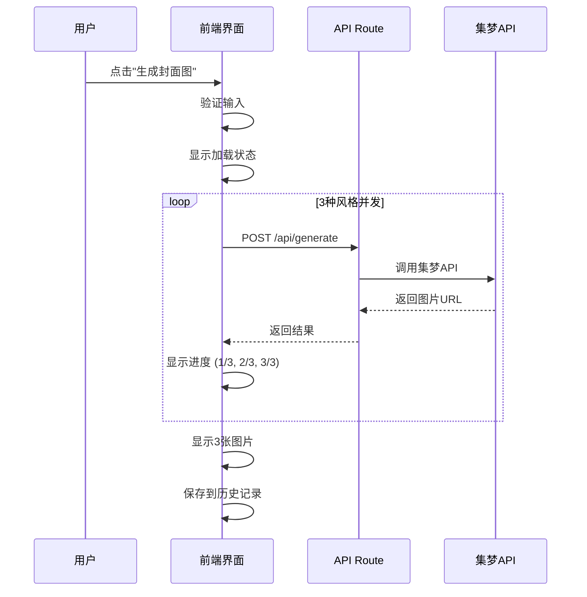

# 西北很荒 AI封面生成器 - 产品需求文档 (PRD)

**文档版本**：v1.0
**最后更新**：2025-12-12
**产品负责人**：西北很荒团队
**目标发布**：MVP版本

---

## 目录
1. [产品概述](#1-产品概述)
2. [市场分析](#2-市场分析)
3. [用户画像与使用场景](#3-用户画像与使用场景)
4. [产品目标](#4-产品目标)
5. [功能需求详述](#5-功能需求详述)
6. [交互设计规范](#6-交互设计规范)
7. [技术架构方案](#7-技术架构方案)
8. [数据设计](#8-数据设计)
9. [风格系统设计](#9-风格系统设计)
10. [非功能性需求](#10-非功能性需求)
11. [项目规划](#11-项目规划)
12. [风险管理](#12-风险管理)
13. [成功指标](#13-成功指标)
14. [附录](#14-附录)

---

## 1. 产品概述

### 1.1 产品定位

**西北很荒 AI封面生成器**是一款基于火山引擎集梦API的免费在线工具，旨在帮助普通用户通过简短的文字描述，快速生成多种风格的高质量封面图片。

**核心理念**：
- **零门槛**：无需设计技能，输入文字即可生成
- **多样化**：一次生成多种风格，满足不同场景需求
- **高效率**：10秒生成，告别耗时的设计过程
- **免费用**：无需注册，开箱即用

### 1.2 产品价值

**用户价值**：
- 节省设计时间和成本
- 获得专业级封面效果
- 快速试错，找到最佳视觉方案
- 降低内容创作门槛

**市场价值**：
- 填补市场空白（简单易用的AI封面工具较少）
- 建立技术品牌形象
- 积累用户数据，为后续产品迭代提供依据

### 1.3 产品范围

**本次MVP包含**：
- ✅ 提示词输入与参数配置
- ✅ 一键生成3张不同风格封面
- ✅ 本地历史记录管理
- ✅ 图片下载功能（单张/批量）

**本次不包含（后续版本）**：
- ❌ 用户注册/登录系统
- ❌ 云端同步
- ❌ 图片二次编辑
- ❌ 社交分享功能
- ❌ 收藏/点赞功能

---

## 2. 市场分析

### 2.1 竞品分析

| 竞品 | 优势 | 劣势 | 差异化策略 |
|------|------|------|-----------|
| Canva | 模板丰富、功能强大 | 需要设计知识、操作复杂 | 零学习成本，AI驱动 |
| MidJourney | 图片质量高、风格多样 | 需Discord、英文prompt、订阅费 | 中文友好、免费、一键多风格 |
| Stable Diffusion | 开源免费、可控性强 | 技术门槛高、需本地部署 | 在线使用、无需配置 |
| 即梦AI | 中文支持、简单易用 | 单次只能生成一种风格 | 同时生成3种风格对比 |

### 2.2 目标市场

**一级目标市场**：
- 小红书/公众号创作者（约500万用户）
- B站/抖音UP主（约300万用户）

**二级目标市场**：
- 企业市场/运营人员
- 学生群体（作业/演示需求）
- 电商从业者（商品封面需求）

**市场规模估算**：
- 潜在用户：800万+
- 每日活跃需求：约10万次封面生成需求
- 市场空间：中等规模垂直领域

---

## 3. 用户画像与使用场景

### 3.1 核心用户画像

**用户A：自媒体创作者 - 小美**
- 年龄：25岁
- 职业：全职小红书博主
- 痛点：
  - 每天需要制作3-5张封面图
  - 不会使用PS等专业工具
  - 外包设计成本高（50-200元/张）
- 需求：快速生成符合小红书风格的封面

**用户B：视频UP主 - 阿强**
- 年龄：22岁
- 职业：B站兼职UP主
- 痛点：
  - 视频制作时间紧，封面常常随便做
  - 封面质量影响点击率
  - 希望多种风格测试效果
- 需求：快速生成多种风格，选择最佳方案

**用户C：企业运营 - 李姐**
- 年龄：30岁
- 职业：电商运营
- 痛点：
  - 需要频繁制作活动海报
  - 设计部门响应慢
  - 需要快速试错
- 需求：快速生成商业风格封面

### 3.2 典型使用场景

**场景1：早晨发布小红书笔记**
```
时间：早上8:00
环境：家中，准备发布今日穿搭笔记
流程：
1. 打开"西北很荒AI封面生成器"
2. 输入："今日穿搭 秋冬毛衣 温暖"
3. 选择比例9:16（竖屏）、风格默认
4. 生成3张图，选择最满意的小红书风格
5. 下载，上传到小红书
时长：2分钟内完成
```

**场景2：制作视频封面**
```
时间：晚上10:00
环境：视频剪辑完成，需要封面
流程：
1. 打开网站
2. 输入："科技评测 新款手机 炫酷"
3. 选择16:9横屏、赛博朋克风格
4. 对比3张图，选择最吸睛的
5. 下载，导入视频编辑软件
时长：3分钟内完成
```

**场景3：电商活动海报**
```
时间：下午3:00
环境：临时需要活动封面
流程：
1. 打开网站
2. 输入："双12大促 全场五折 优惠"
3. 选择商业海报风格
4. 生成后，下载3张给老板选择
5. 确认后用于推广
时长：5分钟内完成
```

---

## 4. 产品目标

### 4.1 商业目标

**短期目标（3个月内）**：
- 积累1000+真实用户
- 日生成量达到500+次
- 建立技术品牌认知

**中期目标（6-12个月）**：
- 月活用户5000+
- 探索付费模式（Pro版）
- 扩展功能边界（图片编辑、更多风格）

**长期目标（1-2年）**：
- 成为垂直领域头部工具
- 建立内容创作生态
- 开放API服务

### 4.2 用户目标

- 生成速度：单次生成 < 15秒
- 满意度：用户对生成结果满意度 > 70%
- 留存率：7日留存率 > 30%
- 推荐度：NPS(净推荐值) > 40

### 4.3 技术目标

- 系统可用性：99.5%+
- API成功率：> 95%
- 首屏加载时间：< 2秒
- 移动端兼容性：主流设备100%支持

---

## 5. 功能需求详述

### 5.1 功能架构图

```
┌─────────────────────────────────────────┐
│           西北很荒 AI封面生成器            │
└─────────────────────────────────────────┘
                    │
        ┌───────────┼───────────┐
        │           │           │
   ┌────▼────┐ ┌───▼────┐ ┌───▼─────┐
   │图片生成  │ │历史记录│ │下载管理 │
   │  模块   │ │  模块  │ │  模块   │
   └────┬────┘ └───┬────┘ └───┬─────┘
        │          │          │
   ┌────▼──────────▼──────────▼─────┐
   │       基础能力层                │
   │  - API调用封装                 │
   │  - LocalStorage管理            │
   │  - 工具函数库                  │
   └────────────────────────────────┘
```

---

### 5.2 功能模块详细设计

#### 5.2.1 图片生成模块

**功能编号**：F-001
**优先级**：P0（最高优先级）

##### 5.2.1.1 提示词输入

**功能描述**：
用户通过文本输入框描述想要生成的封面内容。

**交互细节**：

1. **输入框规格**
   - 类型：Textarea（多行文本框）
   - 占位符文案："描述你想要的封面，例如：咖啡店开业海报 温暖 文艺"
   - 最小高度：60px
   - 最大高度：120px（超出滚动）
   - 字数限制：5-200字
   - 字数显示：实时显示已输入字数 "12/200"

2. **输入验证**
   - 实时验证：字数不足5字时，生成按钮禁用
   - 错误提示：字数不足时显示"至少输入5个字"
   - 提示消失：输入满足条件后自动消失

3. **智能提示**
   - 提供"示例提示词"按钮
   - 点击随机填充示例：
     ```
     示例库：
     - "旅游攻略 海岛风光 清新"
     - "美食探店 日式拉面 温暖"
     - "科技评测 新款手机 炫酷"
     - "读书笔记 励志成长 简约"
     - "健身打卡 力量训练 运动"
     ```

4. **输入优化**
   - 自动去除首尾空格
   - 自动识别并优化中英文标点
   - 支持快捷键：Enter = 生成（单行）、Shift+Enter = 换行

##### 5.2.1.2 参数选择器

**功能描述**：
用户可选择分辨率、比例、风格等参数来定制生成效果。

**参数1：分辨率**

| 选项 | 尺寸说明 | 适用场景 | API参数 | 默认 |
|------|---------|---------|---------|------|
| 标准 | 1024x1024 | 快速预览、社交媒体 | "1024x1024" | ❌ |
| 高清 | 2K | 大部分使用场景 | "2K" | ✅ |
| 超清 | 4K | 印刷、高质量需求 | "4K" | ❌ |

**参数2：比例**

| 选项 | 比例值 | 适用场景 | 实际尺寸(2K) | 默认 |
|------|-------|---------|-------------|------|
| 正方形 | 1:1 | 社交媒体、头像 | 2048x2048 | ✅ |
| 横版 | 16:9 | 视频封面、横屏 | 2560x1440 | ❌ |
| 竖版 | 9:16 | 手机屏幕、故事 | 1440x2560 | ❌ |
| 经典 | 4:3 | 演示文稿 | 2048x1536 | ❌ |

**参数3：风格选择**

**交互方式**：多选下拉菜单（默认选中3个推荐风格）

**风格列表**（共8种精选风格）：

| 风格ID | 风格名称 | 图标 | 适用场景 | 推荐度 | 默认选中 |
|--------|---------|------|---------|--------|---------|
| xiaohongshu | 小红书风格 | 📱 | 社交分享、生活方式 | ⭐⭐⭐⭐⭐ | ✅ |
| business | 商业海报 | 💼 | 品牌宣传、活动推广 | ⭐⭐⭐⭐⭐ | ✅ |
| minimalist | 简约扁平 | ⚪ | 现代设计、科技产品 | ⭐⭐⭐⭐⭐ | ✅ |
| handDrawn | 手绘插画 | 🎨 | 温馨故事、儿童内容 | ⭐⭐⭐⭐ | ❌ |
| cyberpunk | 赛博朋克 | 🌃 | 科技、游戏、未来 | ⭐⭐⭐⭐ | ❌ |
| chinese | 国潮风格 | 🏮 | 传统文化、节日 | ⭐⭐⭐⭐ | ❌ |
| watercolor | 水彩艺术 | 🌈 | 艺术创作、文艺 | ⭐⭐⭐ | ❌ |
| photography | 摄影写实 | 📷 | 真实场景、产品展示 | ⭐⭐⭐ | ❌ |

**风格选择规则**：
- 用户必须选择至少1个风格
- 最多选择3个风格
- 如选择超过3个，提示："最多选择3种风格"
- 默认推荐：小红书 + 商业 + 简约

**UI组件设计**：
```typescript
// 下拉多选组件
<MultiSelect
  options={styles}
  defaultValue={['xiaohongshu', 'business', 'minimalist']}
  maxSelection={3}
  placeholder="选择风格（最多3种）"
  renderOption={(style) => (
    <div className="flex items-center gap-2">
      <span className="text-xl">{style.icon}</span>
      <span>{style.name}</span>
      <Badge>{style.tag}</Badge>
    </div>
  )}
/>
```

##### 5.2.1.3 生成按钮与流程

**按钮状态**：

| 状态 | 文案 | 样式 | 交互 |
|------|------|------|------|
| 默认 | "生成封面图" | 主色调按钮 | 可点击 |
| 禁用 | "生成封面图" | 灰色禁用样式 | 不可点击（提示词不足） |
| 加载中 | "生成中... (1/3)" | 加载动画 | 不可点击 |
| 完成 | "重新生成" | 次要按钮样式 | 可点击 |

**生成流程**：



**加载状态设计**：

1. **骨架屏展示**（0-2秒）
   ```
   [       加载中...      ]
   [       加载中...      ]
   [       加载中...      ]
   ```

2. **进度提示**（2-15秒）
   ```
   ┌─────────────────────┐
   │   正在生成第 1/3 张   │
   │   ████████░░░░ 60%  │
   │   预计还需 5 秒       │
   └─────────────────────┘
   ```

3. **完成展示**
   ```
   ┌─────┐  ┌─────┐  ┌─────┐
   │ 图1 │  │ 图2 │  │ 图3 │
   │风格A│  │风格B│  │风格C│
   └─────┘  └─────┘  └─────┘
   ```

**错误处理**：

| 错误类型 | 提示文案 | 处理方式 |
|---------|---------|---------|
| 网络错误 | "网络连接失败，请检查网络后重试" | 显示重试按钮 |
| API限流 | "请求过于频繁，请稍后再试" | 30秒后允许重试 |
| 内容违规 | "输入内容可能包含敏感信息，请修改后重试" | 清空输入框 |
| 服务异常 | "服务暂时不可用，请稍后重试" | 显示重试按钮 |
| 单个风格失败 | "风格X生成失败" | 其他风格正常显示 |

##### 5.2.1.4 生成结果展示

**布局设计**：

**桌面端（宽度 > 768px）**：
```
┌──────────────────────────────────────────┐
│         生成结果 (3张)                     │
├──────────────────────────────────────────┤
│  ┌──────┐    ┌──────┐    ┌──────┐       │
│  │      │    │      │    │      │       │
│  │ 图片1│    │ 图片2│    │ 图片3│       │
│  │      │    │      │    │      │       │
│  └──────┘    └──────┘    └──────┘       │
│  📱小红书    💼商业      ⚪简约          │
│  [ 下载 ]    [ 下载 ]    [ 下载 ]       │
└──────────────────────────────────────────┘
        [ 全部打包下载 ]
```

**移动端（宽度 ≤ 768px）**：
```
┌───────────────────┐
│   ┌──────────┐    │
│   │          │    │
│   │  图片1   │    │
│   │          │    │
│   └──────────┘    │
│   📱 小红书风格     │
│   [ 下载 ]        │
├───────────────────┤
│   ┌──────────┐    │
│   │  图片2   │    │
│   └──────────┘    │
│   💼 商业海报       │
│   [ 下载 ]        │
└───────────────────┘
```

**单张图片卡片组件**：

```typescript
interface ImageCardProps {
  imageUrl: string;
  styleName: string;
  styleIcon: string;
  onDownload: () => void;
  onPreview: () => void;
}

// 卡片结构
<Card>
  {/* 图片区域 */}
  <div className="relative aspect-square cursor-pointer" onClick={onPreview}>
    <Image src={imageUrl} alt={styleName} fill />
    {/* 悬浮遮罩 */}
    <div className="absolute inset-0 bg-black/50 opacity-0 hover:opacity-100">
      <Button>查看大图</Button>
    </div>
  </div>

  {/* 信息区域 */}
  <CardFooter>
    <div className="flex items-center gap-2">
      <span className="text-xl">{styleIcon}</span>
      <span className="font-medium">{styleName}</span>
    </div>
    <Button onClick={onDownload}>
      <Download className="w-4 h-4 mr-2" />
      下载
    </Button>
  </CardFooter>
</Card>
```

**图片预览（点击查看大图）**：
- 弹出全屏/半屏模态框
- 显示原图
- 支持缩放、拖拽
- 显示图片信息（尺寸、风格）
- 快捷键：ESC关闭、左右箭头切换

---

#### 5.2.2 历史记录模块

**功能编号**：F-002
**优先级**：P0

##### 5.2.2.1 历史记录存储

**存储策略**：
- 存储位置：LocalStorage
- 存储键名：`aicover_history`
- 存储格式：JSON
- 数据结构：
```typescript
interface HistoryStorage {
  version: string;          // 数据版本，用于未来迁移
  lastUpdated: number;      // 最后更新时间戳
  data: HistoryItem[];      // 历史记录数组
}

interface HistoryItem {
  id: string;               // 唯一ID (UUID)
  timestamp: number;        // 生成时间戳
  prompt: string;           // 用户输入的提示词
  settings: {
    resolution: string;     // 分辨率：'1024'|'2K'|'4K'
    ratio: string;          // 比例：'1:1'|'16:9'|'9:16'|'4:3'
  };
  images: {
    url: string;            // 图片URL
    style: string;          // 风格ID
    styleName: string;      // 风格名称
    styleIcon: string;      // 风格图标
  }[];
}
```

**存储限制**：
- 最大记录数：50条
- 超出处理：删除最旧的记录（FIFO）
- 单条记录大小：约1-2KB（不存储base64图片）
- 总存储空间：约50-100KB

**注意事项**：
- 不存储图片的base64数据（过大）
- 只存储图片URL链接
- URL可能过期，需要提示用户重新生成

##### 5.2.2.2 历史记录展示

**UI布局**：

```
┌────────────────────────────────────────┐
│  历史记录 (23)           [ 清空全部 ]   │
├────────────────────────────────────────┤
│  ┌──────────────────────────────────┐ │
│  │ 12-12 14:30                      │ │
│  │ "咖啡店开业海报 温暖 文艺"         │ │
│  │ [缩略图1] [缩略图2] [缩略图3]     │ │
│  │                   [ 删除 ] [ 重新生成 ] │
│  └──────────────────────────────────┘ │
│  ┌──────────────────────────────────┐ │
│  │ 12-12 11:20                      │ │
│  │ "旅游攻略 海岛风光"               │ │
│  │ [缩略图1] [缩略图2] [缩略图3]     │ │
│  │                   [ 删除 ] [ 重新生成 ] │
│  └──────────────────────────────────┘ │
└────────────────────────────────────────┘
```

**交互功能**：

1. **展开/折叠**
   - 默认状态：折叠（显示标题和记录数）
   - 点击展开：显示最近10条记录
   - 下拉加载更多（滚动到底部时）

2. **点击记录**
   - 行为：展开详情，显示3张图片大图
   - 可直接下载历史记录中的图片

3. **删除记录**
   - 单条删除：点击删除按钮
   - 确认弹窗："确定删除这条记录吗？"
   - 清空全部：需二次确认

4. **重新生成**
   - 点击"重新生成"按钮
   - 自动填充提示词和参数
   - 执行新的生成请求

**时间显示格式**：
- 今天：显示"今天 14:30"
- 昨天：显示"昨天 14:30"
- 7天内：显示"星期三 14:30"
- 更早：显示"12月5日 14:30"

**空状态**：
```
┌────────────────────────────────┐
│        🎨                      │
│    还没有生成记录               │
│  快来创建你的第一张封面吧！      │
└────────────────────────────────┘
```

---

#### 5.2.3 下载管理模块

**功能编号**：F-003
**优先级**：P0

##### 5.2.3.1 单张图片下载

**功能描述**：
用户可以下载单张生成的图片到本地。

**实现方式**：
```typescript
async function downloadImage(imageUrl: string, filename: string) {
  // 方案1：直接下载（图片URL同源）
  const a = document.createElement('a');
  a.href = imageUrl;
  a.download = filename;
  a.click();

  // 方案2：跨域图片（通过后端代理）
  const response = await fetch(`/api/download?url=${encodeURIComponent(imageUrl)}`);
  const blob = await response.blob();
  const url = window.URL.createObjectURL(blob);
  const a = document.createElement('a');
  a.href = url;
  a.download = filename;
  a.click();
  window.URL.revokeObjectURL(url);
}
```

**文件命名规则**：
```
格式：封面_{风格}_{时间戳}.png
示例：封面_小红书_20251212143022.png
```

**下载状态提示**：
- 开始下载：Toast提示"正在下载..."
- 下载完成：Toast提示"下载成功"
- 下载失败：Toast提示"下载失败，请重试"

##### 5.2.3.2 批量打包下载

**功能描述**：
用户可以将3张图片打包成ZIP文件一次性下载。

**实现方式**：
```typescript
import JSZip from 'jszip';

async function downloadAllImages(images: Image[]) {
  const zip = new JSZip();

  // 添加图片到ZIP
  for (const [index, image] of images.entries()) {
    const response = await fetch(image.url);
    const blob = await response.blob();
    zip.file(`封面_${image.styleName}_${index + 1}.png`, blob);
  }

  // 生成ZIP文件
  const content = await zip.generateAsync({ type: 'blob' });

  // 触发下载
  const url = window.URL.createObjectURL(content);
  const a = document.createElement('a');
  a.href = url;
  a.download = `AI封面_${Date.now()}.zip`;
  a.click();
  window.URL.revokeObjectURL(url);
}
```

**批量下载按钮**：
- 位置：生成结果区域下方
- 文案："全部打包下载 (3张)"
- 样式：次要按钮（Outline样式）
- 加载状态："打包中... (2/3)"

**ZIP文件结构**：
```
AI封面_20251212143022.zip
├── 封面_小红书_1.png
├── 封面_商业_2.png
└── 封面_简约_3.png
```

---

## 6. 交互设计规范

### 6.1 页面布局

**整体布局结构**（采用中心式布局）：

```
┌─────────────────────────────────────────┐
│              Header 区域                 │  高度：80px
│       Logo + 产品名称 + Slogan          │
├─────────────────────────────────────────┤
│                                         │
│         主内容区（最大宽度1200px）        │
│                                         │
│  ┌────────────────────────────────┐   │
│  │      输入区域（固定在上方）      │   │  高度：auto
│  └────────────────────────────────┘   │
│                                         │
│  ┌────────────────────────────────┐   │
│  │      生成结果区（动态高度）      │   │  高度：auto
│  └────────────────────────────────┘   │
│                                         │
│  ┌────────────────────────────────┐   │
│  │      历史记录区（可折叠）        │   │  高度：auto
│  └────────────────────────────────┘   │
│                                         │
└─────────────────────────────────────────┘
```

**响应式断点**：
- Mobile：< 640px
- Tablet：640px - 1024px
- Desktop：> 1024px

### 6.2 配色方案

**主色调**：
```css
--primary: 220 90% 56%;        /* 蓝色 #2563eb */
--primary-hover: 220 90% 48%;  /* 深蓝 #1d4ed8 */
--secondary: 280 60% 50%;      /* 紫色 #9333ea */
```

**中性色**：
```css
--background: 0 0% 100%;       /* 白色 #ffffff */
--foreground: 222 47% 11%;     /* 深灰 #0f172a */
--muted: 210 40% 96%;          /* 浅灰 #f1f5f9 */
--border: 214 32% 91%;         /* 边框灰 #e2e8f0 */
```

**语义色**：
```css
--success: 142 76% 36%;        /* 绿色 #16a34a */
--warning: 38 92% 50%;         /* 橙色 #f59e0b */
--error: 0 84% 60%;            /* 红色 #ef4444 */
--info: 199 89% 48%;           /* 信息蓝 #0ea5e9 */
```

### 6.3 字体规范

**字体家族**：
```css
font-family:
  -apple-system,
  BlinkMacSystemFont,
  "Segoe UI",
  "PingFang SC",
  "Hiragino Sans GB",
  "Microsoft YaHei",
  sans-serif;
```

**字号系统**：
| 用途 | 大小 | 行高 | 字重 |
|------|------|------|------|
| H1大标题 | 32px | 1.2 | 700 |
| H2标题 | 24px | 1.3 | 600 |
| H3小标题 | 18px | 1.4 | 600 |
| 正文 | 16px | 1.5 | 400 |
| 辅助文字 | 14px | 1.5 | 400 |
| 小字 | 12px | 1.5 | 400 |

### 6.4 间距系统

采用8px基准的间距系统：
```css
--spacing-1: 0.25rem;  /* 4px */
--spacing-2: 0.5rem;   /* 8px */
--spacing-3: 0.75rem;  /* 12px */
--spacing-4: 1rem;     /* 16px */
--spacing-6: 1.5rem;   /* 24px */
--spacing-8: 2rem;     /* 32px */
--spacing-12: 3rem;    /* 48px */
```

### 6.5 动画与过渡

**基础过渡**：
```css
transition: all 0.2s ease-in-out;
```

**常用动画**：
- 按钮悬浮：transform scale(1.02)
- 卡片悬浮：shadow提升
- 加载动画：spin或pulse
- 列表展开：height + opacity

### 6.6 组件状态

**按钮状态**：
- Default：正常样式
- Hover：颜色加深、阴影
- Active：按下效果
- Disabled：灰色、不可点击
- Loading：加载图标旋转

**输入框状态**：
- Default：边框灰色
- Focus：边框主色调、外发光
- Error：边框红色、错误提示
- Disabled：灰色背景

---

## 7. 技术架构方案

### 7.1 整体架构图

```
┌─────────────────────────────────────────┐
│           用户浏览器                     │
│  ┌─────────────────────────────────┐   │
│  │   React组件层                    │   │
│  │  - 页面组件                      │   │
│  │  - UI组件（shadcn/ui）           │   │
│  └──────────────┬──────────────────┘   │
│                 │                       │
│  ┌──────────────▼──────────────────┐   │
│  │   状态管理层                     │   │
│  │  - React Hooks (useState等)     │   │
│  │  - LocalStorage工具             │   │
│  └──────────────┬──────────────────┘   │
│                 │                       │
│  ┌──────────────▼──────────────────┐   │
│  │   业务逻辑层                     │   │
│  │  - API调用封装                   │   │
│  │  - 工具函数                      │   │
│  └──────────────┬──────────────────┘   │
└─────────────────┼───────────────────────┘
                  │
                  │ HTTPS
                  │
┌─────────────────▼───────────────────────┐
│      Next.js服务器（Vercel部署）         │
│  ┌─────────────────────────────────┐   │
│  │   API Routes (后端)              │   │
│  │  - /api/generate                │   │
│  │  - /api/download                │   │
│  └──────────────┬──────────────────┘   │
└─────────────────┼───────────────────────┘
                  │
                  │ HTTPS
                  │
┌─────────────────▼───────────────────────┐
│      火山引擎 - 集梦API                  │
│  https://ark.cn-beijing.volces.com     │
└─────────────────────────────────────────┘
```

### 7.2 目录结构设计

```
/xibeihenhuangAICover
├── app/                           # Next.js App Router
│   ├── api/                       # API路由
│   │   ├── generate/
│   │   │   └── route.ts          # 生成图片API
│   │   └── download/
│   │       └── route.ts          # 下载代理API
│   ├── layout.tsx                 # 根布局
│   ├── page.tsx                   # 首页
│   ├── globals.css                # 全局样式
│   └── error.tsx                  # 错误页面
│
├── components/                    # 组件目录
│   ├── ui/                        # shadcn/ui基础组件
│   │   ├── button.tsx
│   │   ├── input.tsx
│   │   ├── card.tsx
│   │   ├── select.tsx
│   │   ├── toast.tsx
│   │   ├── dialog.tsx
│   │   └── ...
│   │
│   ├── layout/                    # 布局组件
│   │   ├── Header.tsx             # 页头
│   │   ├── Footer.tsx             # 页脚
│   │   └── Container.tsx          # 容器
│   │
│   ├── generator/                 # 生成器相关组件
│   │   ├── ImageGenerator.tsx     # 主生成器组件
│   │   ├── PromptInput.tsx        # 提示词输入
│   │   ├── ParameterSelector.tsx  # 参数选择器
│   │   ├── ResolutionSelect.tsx   # 分辨率选择
│   │   ├── RatioSelect.tsx        # 比例选择
│   │   └── StyleSelect.tsx        # 风格选择
│   │
│   ├── result/                    # 结果展示组件
│   │   ├── GeneratedImages.tsx    # 生成结果容器
│   │   ├── ImageCard.tsx          # 图片卡片
│   │   ├── ImagePreview.tsx       # 图片预览弹窗
│   │   └── DownloadButton.tsx     # 下载按钮
│   │
│   └── history/                   # 历史记录组件
│       ├── HistoryPanel.tsx       # 历史记录面板
│       ├── HistoryItem.tsx        # 单条历史记录
│       └── HistoryEmpty.tsx       # 空状态
│
├── lib/                           # 工具库
│   ├── api/                       # API相关
│   │   ├── client.ts              # API客户端封装
│   │   ├── generate.ts            # 生成图片接口
│   │   └── types.ts               # API类型定义
│   │
│   ├── storage/                   # 存储相关
│   │   ├── history.ts             # 历史记录存储
│   │   └── localStorage.ts        # LocalStorage封装
│   │
│   ├── styles/                    # 风格系统
│   │   ├── templates.ts           # 风格模板
│   │   └── constants.ts           # 风格常量
│   │
│   ├── utils/                     # 工具函数
│   │   ├── download.ts            # 下载工具
│   │   ├── format.ts              # 格式化工具
│   │   ├── validation.ts          # 验证工具
│   │   └── cn.ts                  # className工具
│   │
│   └── hooks/                     # 自定义Hooks
│       ├── useImageGeneration.ts  # 图片生成Hook
│       ├── useHistory.ts          # 历史记录Hook
│       ├── useDownload.ts         # 下载Hook
│       └── useToast.ts            # Toast提示Hook
│
├── types/                         # TypeScript类型
│   ├── index.ts                   # 主类型文件
│   ├── api.ts                     # API类型
│   ├── history.ts                 # 历史记录类型
│   └── style.ts                   # 风格类型
│
├── config/                        # 配置文件
│   ├── site.ts                    # 站点配置
│   ├── styles.ts                  # 风格配置
│   └── constants.ts               # 常量配置
│
├── public/                        # 静态资源
│   ├── images/
│   │   ├── logo.svg
│   │   └── placeholder.png
│   └── fonts/
│
├── .env.local                     # 环境变量（不提交）
├── .env.example                   # 环境变量示例
├── next.config.ts                 # Next.js配置
├── tailwind.config.ts             # Tailwind配置
├── tsconfig.json                  # TypeScript配置
├── components.json                # shadcn/ui配置
├── package.json                   # 依赖配置
└── README.md                      # 项目说明
```

### 7.3 技术栈详细说明

#### 7.3.1 前端技术栈

| 技术 | 版本 | 用途 | 理由 |
|------|------|------|------|
| Next.js | 15.1.0 | React框架 | SSR/SSG、API Routes、优化性能 |
| React | 19.0.0 | UI库 | 组件化、生态丰富 |
| TypeScript | 5.x | 类型系统 | 类型安全、提升开发效率 |
| Tailwind CSS | 3.4.1 | CSS框架 | 快速开发、一致性高 |
| shadcn/ui | latest | UI组件库 | 美观、可定制、基于Radix UI |
| Lucide React | 0.560.0 | 图标库 | 现代、轻量 |
| JSZip | 3.10.1 | ZIP打包 | 批量下载功能 |

#### 7.3.2 依赖包补充

需要添加的依赖：
```json
{
  "dependencies": {
    "jszip": "^3.10.1",              // ZIP打包
    "uuid": "^11.0.3",                // 生成唯一ID
    "date-fns": "^4.1.0"             // 时间格式化
  },
  "devDependencies": {
    "@types/uuid": "^10.0.0"         // UUID类型
  }
}
```

### 7.4 API设计

#### 7.4.1 生成图片API

**路由**：`POST /api/generate`

**请求体**：
```typescript
interface GenerateRequest {
  prompt: string;           // 用户输入提示词
  resolution: '1024' | '2K' | '4K';
  ratio: '1:1' | '16:9' | '9:16' | '4:3';
  styles: string[];         // 风格ID数组，最多3个
}
```

**响应体**：
```typescript
interface GenerateResponse {
  success: boolean;
  data?: {
    images: {
      url: string;          // 图片URL
      style: string;        // 风格ID
      styleName: string;    // 风格名称
      styleIcon: string;    // 风格图标
    }[];
  };
  error?: {
    code: string;           // 错误码
    message: string;        // 错误信息
  };
}
```

**错误码定义**：
```typescript
enum ErrorCode {
  INVALID_PROMPT = 'INVALID_PROMPT',          // 提示词无效
  API_ERROR = 'API_ERROR',                    // API调用失败
  RATE_LIMIT = 'RATE_LIMIT',                  // 请求限流
  CONTENT_VIOLATION = 'CONTENT_VIOLATION',    // 内容违规
  NETWORK_ERROR = 'NETWORK_ERROR',            // 网络错误
  UNKNOWN = 'UNKNOWN'                         // 未知错误
}
```

**实现逻辑**：
```typescript
// app/api/generate/route.ts
import { NextRequest, NextResponse } from 'next/server';
import { styleTemplates } from '@/lib/styles/templates';

export async function POST(request: NextRequest) {
  try {
    const body = await request.json();
    const { prompt, resolution, ratio, styles } = body;

    // 验证输入
    if (!prompt || prompt.length < 5 || prompt.length > 200) {
      return NextResponse.json({
        success: false,
        error: {
          code: 'INVALID_PROMPT',
          message: '提示词长度必须在5-200字之间'
        }
      }, { status: 400 });
    }

    // 并发调用集梦API生成多张图
    const promises = styles.map(async (styleId: string) => {
      const template = styleTemplates[styleId];
      const fullPrompt = template.prompt.replace('{用户输入}', prompt);

      const response = await fetch(
        'https://ark.cn-beijing.volces.com/api/v3/images/generations',
        {
          method: 'POST',
          headers: {
            'Content-Type': 'application/json',
            'Authorization': `Bearer ${process.env.JIMENG_API_KEY}`
          },
          body: JSON.stringify({
            model: 'doubao-seedream-4-5-251128',
            prompt: fullPrompt,
            size: resolution,
            watermark: false
          })
        }
      );

      if (!response.ok) {
        throw new Error(`API调用失败: ${response.status}`);
      }

      const data = await response.json();
      return {
        url: data.data[0].url,  // 假设返回格式
        style: styleId,
        styleName: template.name,
        styleIcon: template.icon
      };
    });

    const images = await Promise.all(promises);

    return NextResponse.json({
      success: true,
      data: { images }
    });

  } catch (error) {
    console.error('生成图片失败:', error);
    return NextResponse.json({
      success: false,
      error: {
        code: 'API_ERROR',
        message: '生成图片失败，请稍后重试'
      }
    }, { status: 500 });
  }
}
```

#### 7.4.2 下载代理API

**路由**：`GET /api/download?url={imageUrl}`

**用途**：解决跨域图片下载问题

**实现**：
```typescript
// app/api/download/route.ts
import { NextRequest, NextResponse } from 'next/server';

export async function GET(request: NextRequest) {
  const url = request.nextUrl.searchParams.get('url');

  if (!url) {
    return NextResponse.json(
      { error: '缺少URL参数' },
      { status: 400 }
    );
  }

  try {
    const response = await fetch(url);
    const blob = await response.blob();

    return new NextResponse(blob, {
      headers: {
        'Content-Type': 'image/png',
        'Content-Disposition': 'attachment; filename="image.png"'
      }
    });
  } catch (error) {
    return NextResponse.json(
      { error: '下载失败' },
      { status: 500 }
    );
  }
}
```

### 7.5 环境变量配置

**创建 `.env.local` 文件**：
```bash
# 集梦API配置
JIMENG_API_KEY=5a432dbb-2b13-4f93-9109-db6461d92b24
JIMENG_API_URL=https://ark.cn-beijing.volces.com/api/v3/images/generations

# Next.js配置
NEXT_PUBLIC_APP_URL=http://localhost:3000
```

**创建 `.env.example` 文件**（供参考，提交到Git）：
```bash
# 集梦API配置
JIMENG_API_KEY=your_api_key_here
JIMENG_API_URL=https://ark.cn-beijing.volces.com/api/v3/images/generations

# Next.js配置
NEXT_PUBLIC_APP_URL=http://localhost:3000
```

---

## 8. 数据设计

### 8.1 TypeScript类型定义

```typescript
// types/index.ts

// ========== 基础类型 ==========

/** 分辨率选项 */
export type Resolution = '1024' | '2K' | '4K';

/** 比例选项 */
export type Ratio = '1:1' | '16:9' | '9:16' | '4:3';

/** 风格ID */
export type StyleId =
  | 'xiaohongshu'
  | 'business'
  | 'minimalist'
  | 'handDrawn'
  | 'cyberpunk'
  | 'chinese'
  | 'watercolor'
  | 'photography';

// ========== 风格系统 ==========

/** 风格模板 */
export interface StyleTemplate {
  id: StyleId;
  name: string;              // 显示名称
  tag: string;               // 标签文字
  icon: string;              // emoji图标
  prompt: string;            // prompt模板
  description: string;       // 描述
  recommended: boolean;      // 是否推荐
  category: StyleCategory;   // 分类
}

/** 风格分类 */
export type StyleCategory = 'social' | 'business' | 'art' | 'tech';

// ========== 生成参数 ==========

/** 生成配置 */
export interface GenerateSettings {
  prompt: string;            // 用户输入
  resolution: Resolution;    // 分辨率
  ratio: Ratio;              // 比例
  styles: StyleId[];         // 选中的风格（1-3个）
}

/** 生成状态 */
export type GenerateStatus = 'idle' | 'loading' | 'success' | 'error';

// ========== 图片数据 ==========

/** 生成的图片 */
export interface GeneratedImage {
  id: string;                // 图片唯一ID
  url: string;               // 图片URL
  style: StyleId;            // 风格ID
  styleName: string;         // 风格名称
  styleIcon: string;         // 风格图标
  timestamp: number;         // 生成时间
}

// ========== 历史记录 ==========

/** 历史记录项 */
export interface HistoryItem {
  id: string;                // 记录唯一ID (UUID)
  timestamp: number;         // 生成时间戳
  prompt: string;            // 提示词
  settings: {
    resolution: Resolution;
    ratio: Ratio;
  };
  images: GeneratedImage[];  // 生成的图片列表
}

/** 历史记录存储 */
export interface HistoryStorage {
  version: string;           // 数据版本号
  lastUpdated: number;       // 最后更新时间
  data: HistoryItem[];       // 历史记录数组
}

// ========== API类型 ==========

/** API请求 */
export interface GenerateRequest {
  prompt: string;
  resolution: Resolution;
  ratio: Ratio;
  styles: StyleId[];
}

/** API响应 */
export interface GenerateResponse {
  success: boolean;
  data?: {
    images: GeneratedImage[];
  };
  error?: ApiError;
}

/** API错误 */
export interface ApiError {
  code: ErrorCode;
  message: string;
}

/** 错误码 */
export enum ErrorCode {
  INVALID_PROMPT = 'INVALID_PROMPT',
  API_ERROR = 'API_ERROR',
  RATE_LIMIT = 'RATE_LIMIT',
  CONTENT_VIOLATION = 'CONTENT_VIOLATION',
  NETWORK_ERROR = 'NETWORK_ERROR',
  UNKNOWN = 'UNKNOWN'
}

// ========== UI状态 ==========

/** 生成器状态 */
export interface GeneratorState {
  status: GenerateStatus;
  progress: number;          // 进度 0-100
  currentStep: number;       // 当前步骤 1-3
  totalSteps: number;        // 总步骤数
  error: ApiError | null;
  result: GeneratedImage[] | null;
}
```

### 8.2 LocalStorage数据格式

**存储键名**：
```typescript
const STORAGE_KEYS = {
  HISTORY: 'aicover_history',
  VERSION: 'aicover_version',
  USER_SETTINGS: 'aicover_settings'
} as const;
```

**历史记录示例**：
```json
{
  "version": "1.0.0",
  "lastUpdated": 1702345678000,
  "data": [
    {
      "id": "550e8400-e29b-41d4-a716-446655440000",
      "timestamp": 1702345678000,
      "prompt": "咖啡店开业海报 温暖 文艺",
      "settings": {
        "resolution": "2K",
        "ratio": "1:1"
      },
      "images": [
        {
          "id": "img-1",
          "url": "https://example.com/image1.png",
          "style": "xiaohongshu",
          "styleName": "小红书风格",
          "styleIcon": "📱",
          "timestamp": 1702345678000
        },
        {
          "id": "img-2",
          "url": "https://example.com/image2.png",
          "style": "business",
          "styleName": "商业海报",
          "styleIcon": "💼",
          "timestamp": 1702345679000
        },
        {
          "id": "img-3",
          "url": "https://example.com/image3.png",
          "style": "minimalist",
          "styleName": "简约扁平",
          "styleIcon": "⚪",
          "timestamp": 1702345680000
        }
      ]
    }
  ]
}
```

---

## 9. 风格系统设计

### 9.1 风格模板完整定义

```typescript
// lib/styles/templates.ts

import { StyleTemplate } from '@/types';

export const styleTemplates: Record<string, StyleTemplate> = {
  xiaohongshu: {
    id: 'xiaohongshu',
    name: '小红书风格',
    tag: '小红书',
    icon: '📱',
    category: 'social',
    recommended: true,
    description: '清新温暖，适合社交分享',
    prompt: `你是一名百万粉丝的小红书博主，请为"{用户输入}"生成一张小红书风格的封面图。

要求：
1. 配色清新温暖，使用马卡龙色系或莫兰迪色系
2. 画面中包含醒目的标题文字，使用emoji增加趣味性
3. 构图简洁有层次，留白得当
4. 适合社交媒体传播，能够吸引眼球
5. 现代年轻化的视觉风格

风格关键词：小红书、清新、温暖、emoji、标题文字、吸睛`
  },

  business: {
    id: 'business',
    name: '商业海报',
    tag: '商业',
    icon: '💼',
    category: 'business',
    recommended: true,
    description: '专业高端，适合品牌宣传',
    prompt: `为"{用户输入}"设计一张专业的商业海报封面。

要求：
1. 高端大气的配色，如深蓝、金色、黑白灰等商务色系
2. 品牌感强，专业可信赖的视觉呈现
3. 简洁有力，重点突出
4. 符合现代商业设计美学
5. 适合企业宣传、活动推广等场景

风格关键词：商业、专业、高端、品牌感、现代`
  },

  minimalist: {
    id: 'minimalist',
    name: '简约扁平',
    tag: '简约',
    icon: '⚪',
    category: 'business',
    recommended: true,
    description: '现代简洁，适合科技产品',
    prompt: `为"{用户输入}"设计一张简约扁平风格的封面。

要求：
1. 几何图形构成，线条简洁流畅
2. 纯色或渐变配色，色彩不超过3种
3. 留白设计，负空间利用
4. 扁平化插画风格，无阴影或立体效果
5. 现代极简主义美学

风格关键词：扁平化、极简、几何、现代、简洁`
  },

  handDrawn: {
    id: 'handDrawn',
    name: '手绘插画',
    tag: '手绘',
    icon: '🎨',
    category: 'art',
    recommended: false,
    description: '温馨治愈，适合故事内容',
    prompt: `为"{用户输入}"绘制一张温馨的手绘插画风格封面。

要求：
1. 柔和的色彩，水粉或彩铅质感
2. 手工绘制感，线条自然不规则
3. 可爱亲切，温暖治愈的氛围
4. 适合儿童内容、温馨故事等场景
5. 插画风格细腻，富有情感

风格关键词：手绘、插画、温馨、可爱、治愈`
  },

  cyberpunk: {
    id: 'cyberpunk',
    name: '赛博朋克',
    tag: '赛博',
    icon: '🌃',
    category: 'tech',
    recommended: false,
    description: '科技炫酷，适合游戏科技',
    prompt: `为"{用户输入}"创作一张赛博朋克风格的封面。

要求：
1. 霓虹色彩，主要使用蓝、紫、粉等荧光色
2. 未来城市、高楼大厦、霓虹灯牌等元素
3. 科技感强烈，充满未来感
4. 暗色调背景，霓虹灯光对比
5. 赛博朋克独有的颓废未来美学

风格关键词：赛博朋克、霓虹、科技、未来、炫酷`
  },

  chinese: {
    id: 'chinese',
    name: '国潮风格',
    tag: '国潮',
    icon: '🏮',
    category: 'art',
    recommended: false,
    description: '国风现代，适合传统文化',
    prompt: `为"{用户输入}"设计一张国潮风格的封面。

要求：
1. 中国传统元素融入现代设计
2. 国风配色，如中国红、靛蓝、墨绿等
3. 传统纹样、书法、水墨等元素
4. 现代排版与传统艺术结合
5. 展现文化自信和东方美学

风格关键词：国潮、国风、传统元素、现代融合、东方美学`
  },

  watercolor: {
    id: 'watercolor',
    name: '水彩艺术',
    tag: '水彩',
    icon: '🌈',
    category: 'art',
    recommended: false,
    description: '柔和艺术，适合文艺内容',
    prompt: `为"{用户输入}"创作一张水彩艺术风格的封面。

要求：
1. 柔和的水彩晕染效果
2. 色彩自然流动，渐变过渡
3. 艺术感强，富有美感
4. 适合文艺、诗歌、情感类内容
5. 水彩特有的透明感和层次感

风格关键词：水彩、艺术、柔和、晕染、文艺`
  },

  photography: {
    id: 'photography',
    name: '摄影写实',
    tag: '摄影',
    icon: '📷',
    category: 'business',
    recommended: false,
    description: '真实高清，适合产品展示',
    prompt: `为"{用户输入}"创作一张摄影写实风格的封面。

要求：
1. 真实摄影质感，高清细腻
2. 自然光影效果，景深明显
3. 构图专业，符合摄影美学
4. 适合产品展示、真实场景等
5. 写实风格，追求真实感

风格关键词：摄影、写实、真实、高清、专业`
  }
};

// 获取推荐风格
export function getRecommendedStyles(): StyleTemplate[] {
  return Object.values(styleTemplates).filter(s => s.recommended);
}

// 按分类获取风格
export function getStylesByCategory(category: string): StyleTemplate[] {
  return Object.values(styleTemplates).filter(s => s.category === category);
}

// 获取所有风格
export function getAllStyles(): StyleTemplate[] {
  return Object.values(styleTemplates);
}
```

### 9.2 Prompt工程原则

**设计原则**：
1. **明确指令**：清楚说明要生成什么类型的图片
2. **风格描述**：详细描述视觉风格特征
3. **具体要求**：列出具体的视觉元素和要求
4. **场景适配**：说明适用场景和目标受众
5. **关键词提示**：使用关键词强化风格特征

**Prompt结构**：
```
角色定位 + 任务描述 + 具体要求 + 风格关键词
```

**变量替换**：
- 用户输入通过 `{用户输入}` 标记插入
- 最终prompt由模板 + 用户输入组合而成

---

## 10. 非功能性需求

### 10.1 性能要求

| 指标 | 目标值 | 测量方法 |
|------|--------|---------|
| 首屏加载时间 | < 2秒 | Lighthouse |
| API响应时间 | < 15秒 | 后端日志 |
| 页面交互响应 | < 100ms | Chrome DevTools |
| 图片加载时间 | < 3秒 | Network面板 |

**优化策略**：
- 代码分割（Code Splitting）
- 图片懒加载
- CDN加速
- 缓存策略

### 10.2 兼容性要求

**浏览器支持**：
- Chrome >= 90
- Firefox >= 88
- Safari >= 14
- Edge >= 90
- 移动端浏览器（iOS Safari, Chrome Mobile）

**设备支持**：
- 桌面端：1920x1080, 1366x768
- 平板：iPad, Android Tablet
- 手机：iPhone 12+, Android旗舰机

### 10.3 可用性要求

- **系统可用性**：99.5%（月度）
- **错误率**：< 1%
- **API成功率**：> 95%

### 10.4 安全要求

**API安全**：
- API Key存储在服务端环境变量
- 不在前端暴露敏感信息
- HTTPS加密传输

**内容安全**：
- 输入验证，防止XSS攻击
- 内容审核，拒绝违规内容
- 限流机制，防止滥用

**数据安全**：
- LocalStorage数据加密（可选）
- 不存储用户隐私信息

### 10.5 可访问性（A11y）

- 键盘导航支持
- ARIA标签
- 颜色对比度符合WCAG 2.1 AA标准
- 屏幕阅读器友好

---

## 11. 项目规划

### 11.1 开发阶段

#### Phase 1：基础搭建（1-2天）

**任务清单**：
- [ ] 搭建项目基础结构
- [ ] 配置shadcn/ui组件
- [ ] 创建基础布局组件（Header, Container）
- [ ] 实现响应式布局
- [ ] 配置环境变量
- [ ] 测试Next.js API Routes

**交付物**：
- 可运行的项目框架
- 基础UI组件库

#### Phase 2：核心功能开发（3-4天）

**Sprint 2.1：图片生成模块（2天）**
- [ ] 实现提示词输入组件
- [ ] 实现参数选择器（分辨率/比例/风格）
- [ ] 封装集梦API调用
- [ ] 实现生成流程和状态管理
- [ ] 实现加载状态和错误处理
- [ ] 实现生成结果展示

**Sprint 2.2：历史与下载（1-2天）**
- [ ] 实现LocalStorage历史记录存储
- [ ] 实现历史记录UI
- [ ] 实现单张图片下载
- [ ] 实现批量打包下载（JSZip）
- [ ] 实现历史记录管理（删除、清空）

**交付物**：
- 完整的MVP功能
- 可用的生成、历史、下载功能

#### Phase 3：优化与测试（2-3天）

**任务清单**：
- [ ] 性能优化（懒加载、代码分割）
- [ ] 移动端适配测试
- [ ] 浏览器兼容性测试
- [ ] 错误边界和异常处理
- [ ] UI细节优化
- [ ] 用户体验优化（动画、过渡）
- [ ] 撰写README文档

**交付物**：
- 经过测试的稳定版本
- 完整的项目文档

#### Phase 4：部署上线（1天）

**任务清单**：
- [ ] 配置生产环境变量
- [ ] Vercel部署配置
- [ ] 域名绑定（如有）
- [ ] 性能监控配置
- [ ] 错误日志配置
- [ ] 上线验证测试

**交付物**：
- 线上可访问的产品
- 监控仪表盘

### 11.2 项目时间表

```
Week 1
├── Day 1-2: Phase 1 基础搭建
├── Day 3-4: Phase 2.1 图片生成模块
└── Day 5-6: Phase 2.2 历史与下载

Week 2
├── Day 1-2: Phase 3 优化与测试
└── Day 3: Phase 4 部署上线

总计：8-10个工作日
```

### 11.3 人力资源

**单人开发**（全栈）：
- 前端开发：5-6天
- 后端开发：1-2天
- 测试优化：2天
- 部署运维：0.5天

**总计**：8-10天（1人）

### 11.4 里程碑

| 里程碑 | 日期 | 关键交付物 |
|--------|------|-----------|
| M1: 项目启动 | Day 1 | 项目框架搭建完成 |
| M2: Alpha版本 | Day 4 | 基础生成功能完成 |
| M3: Beta版本 | Day 6 | 全部功能完成 |
| M4: RC版本 | Day 8 | 测试优化完成 |
| M5: 正式发布 | Day 10 | 上线发布 |

---

## 12. 风险管理

### 12.1 技术风险

| 风险 | 影响 | 概率 | 应对策略 |
|------|------|------|---------|
| 集梦API不稳定 | 高 | 中 | 实现重试机制、备用API方案 |
| API限流 | 中 | 高 | 前端限流、提示用户、队列机制 |
| 图片URL过期 | 中 | 中 | 提示用户重新生成、缓存策略 |
| LocalStorage容量限制 | 低 | 低 | 限制历史记录数量、定期清理 |
| 浏览器兼容性问题 | 中 | 低 | 充分测试、Polyfill兜底 |

### 12.2 业务风险

| 风险 | 影响 | 概率 | 应对策略 |
|------|------|------|---------|
| 用户生成违规内容 | 高 | 中 | 内容审核、用户协议 |
| API成本过高 | 中 | 中 | 用量监控、成本预警 |
| 用户留存率低 | 中 | 中 | 数据分析、产品迭代 |
| 竞品压力 | 低 | 中 | 持续优化、差异化特色 |

### 12.3 运营风险

| 风险 | 影响 | 概率 | 应对策略 |
|------|------|------|---------|
| 服务器宕机 | 高 | 低 | 云服务高可用、监控告警 |
| 流量突增 | 中 | 低 | 自动扩容、CDN加速 |
| 数据丢失 | 中 | 低 | 本地存储、用户导出功能 |

---

## 13. 成功指标

### 13.1 产品指标

**核心指标（North Star Metric）**：
- **每日生成次数**：目标500+次/天

**关键指标（KPI）**：
| 指标 | 目标值 | 测量周期 |
|------|--------|---------|
| 新用户数 | 1000+ | 首月 |
| 日活用户(DAU) | 100+ | 首月 |
| 周活用户(WAU) | 300+ | 首月 |
| 生成成功率 | >95% | 持续 |
| 用户满意度 | >70% | 月度调研 |
| 7日留存率 | >30% | 持续 |

### 13.2 技术指标

| 指标 | 目标值 | 测量方式 |
|------|--------|---------|
| 首屏加载时间 | <2秒 | Lighthouse |
| API响应时间 | <15秒 | 后端监控 |
| 系统可用性 | >99.5% | 正常运行时间监控 |
| 错误率 | <1% | 错误日志统计 |

### 13.3 用户体验指标

| 指标 | 目标值 | 测量方式 |
|------|--------|---------|
| 操作完成率 | >80% | 用户行为分析 |
| 平均生成时间 | <20秒 | 后端日志 |
| 下载转化率 | >60% | 事件追踪 |
| NPS净推荐值 | >40 | 用户调研 |

### 13.4 数据埋点

**关键事件追踪**：
```typescript
enum TrackingEvent {
  PAGE_VIEW = 'page_view',              // 页面访问
  GENERATE_START = 'generate_start',    // 开始生成
  GENERATE_SUCCESS = 'generate_success',// 生成成功
  GENERATE_ERROR = 'generate_error',    // 生成失败
  IMAGE_DOWNLOAD = 'image_download',    // 图片下载
  BATCH_DOWNLOAD = 'batch_download',    // 批量下载
  HISTORY_VIEW = 'history_view',        // 查看历史
  STYLE_SELECT = 'style_select'         // 选择风格
}
```

---

## 14. 附录

### 14.1 术语表

| 术语 | 说明 |
|------|------|
| MVP | Minimum Viable Product，最小可行产品 |
| DAU | Daily Active Users，日活跃用户 |
| WAU | Weekly Active Users，周活跃用户 |
| NPS | Net Promoter Score，净推荐值 |
| A11y | Accessibility，可访问性 |
| SEO | Search Engine Optimization，搜索引擎优化 |
| CDN | Content Delivery Network，内容分发网络 |
| API | Application Programming Interface，应用程序接口 |

### 14.2 参考资料

**技术文档**：
- [Next.js官方文档](https://nextjs.org/docs)
- [shadcn/ui组件库](https://ui.shadcn.com/)
- [Tailwind CSS文档](https://tailwindcss.com/docs)
- [火山引擎集梦API文档](https://www.volcengine.com/docs/82379/1541523)

**设计参考**：
- [Dribbble - AI工具设计](https://dribbble.com/search/ai-tool)
- [小红书 - 视觉设计风格](https://www.xiaohongshu.com)

### 14.3 更新日志

| 版本 | 日期 | 更新内容 | 作者 |
|------|------|---------|------|
| v1.0 | 2025-12-12 | 初始PRD文档 | 产品团队 |

### 14.4 待解决问题

**技术问题**：
1. 集梦API返回的图片URL过期时间？
2. API调用频率限制？
3. 单次请求是否支持批量生成？

**产品问题**：
1. 是否需要添加图片编辑功能？
2. 是否需要提供公开分享功能？
3. 后续是否考虑用户系统？

### 14.5 FAQ

**Q: 为什么不需要用户登录？**
A: MVP阶段聚焦核心功能，降低使用门槛。后续版本可以增加可选的用户系统。

**Q: 历史记录会永久保存吗？**
A: 使用LocalStorage本地存储，数据只保存在用户浏览器中，清除浏览器数据会丢失。

**Q: 生成的图片版权归谁？**
A: 根据集梦API协议，需要在用户协议中明确说明版权归属。

**Q: 如何保证生成速度？**
A: 并发调用API、优化prompt、使用CDN加速图片加载。

**Q: 如何防止滥用？**
A: 前端限流（每分钟最多3次）、后端监控异常请求、可考虑加入验证码。

---

## 文档结束

**总页数**：完整PRD文档
**字数统计**：约15,000字
**最后更新**：2025-12-12

**文档状态**：✅ 已完成，待审核

---

PRD文档已输出完成。这份文档涵盖了产品的完整需求，包括：

✅ 产品定位与价值
✅ 市场分析与竞品对比
✅ 用户画像与使用场景
✅ 详细的功能需求设计
✅ 完整的技术架构方案
✅ 数据结构与类型定义
✅ 风格系统与Prompt工程
✅ 项目规划与里程碑
✅ 风险管理与成功指标

现在可以基于这份PRD文档开始实施开发了！